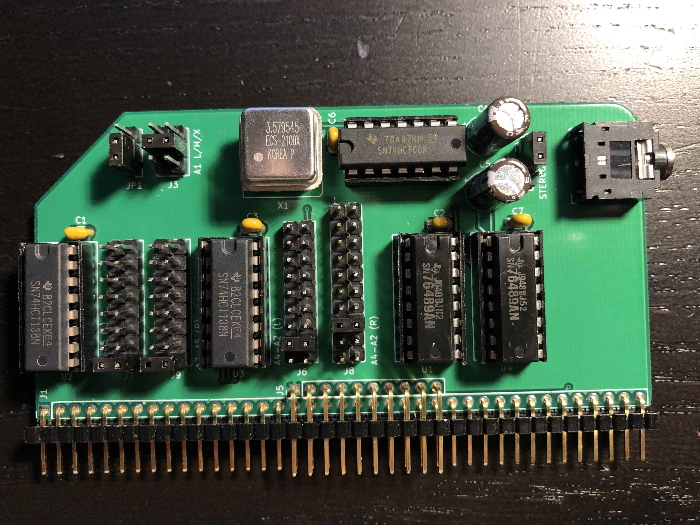

# SN76489 Sound Card for RC2014

This is a SN76489-based sound card for the RC2014.  It is a very simple chip, only capable of producing square waves and a noise channel, without any envelope control or filters. This chip was used in the TI-99/4A, ColecoVision, Sega SG-1000, Sega Master System, Sega Genesis, IBM PCjr, Tandy 1000, BBC Micro, as well as many arcade games.

The board can optionally support two SN76489 chips for 6 channel stereo sound, but currently this is unsupported by any software.  If stereo sound is not desired, then the second chip and its supporting components can be omitted.  

## Assembly Instructions

[Ready-to-Assemble Kits](https://www.tindie.com/products/mfkamprath/sn76489-sound-card-kit-for-rc2014/) are available on Tindie.  These are sold by Michael Kamprath with my permission.  However, I offer no warranty or guarantee of support.

[Gerbers](https://cdn.hackaday.io/files/1590576805094688/SN76489_rev3_gerbers.zip) for the PCB are available. I highly recommend [JLCPCB](https://jlcpcb.com/) for PCB fabrication. Alternatively, boards can be ordered from the shared project on [OSH Park](https://oshpark.com/shared_projects/hBqAD8GX).

Refer to the [schematic](SN76489.pdf), the picture below, and the bill of materials below for assembly guidance.

### Bill of Materials

All parts except for the SN76489 are available from Mouser.  The SN76489 can be obtained from eBay.

| Reference | Part |
|-|-|
| J1, J5 | 2x40 right angle pin header with extra pins removed from top row |
| JP1, JP2 | 1x3 straight pin header |
| J7, J9* | 2x8 straight pin header |
| J6 | 2x9 straight pin header |
| J8* | 2x10 straight pin header |
| J11 | 2x3 stright pin header |
| | Jumper blocks for each jumper (9 total) |
| J2 | CUI SJ1-3523N audio jack |
| X1 | ECS-2100AX-3.579545MHZ DIP-8 clock oscillator |
| C1-C3, C6-C7 | 0.1uf ceramic disc or MLCC capacitor |
| C4, C5* | 470 uf electrolytic capacitor |
| U2, U3** | 74HCT138 3-8 line decoder |
| U1, U4* | TI SN76489 sound chip |
| U5 | 74HCT00 quad NAND gate |

Some components are optional: 

*U4, C3, C5, J8 and J9 can be omitted if you do not want stereo sound. 

**U3 and C2 can be omitted if you don't need tight address decoding.

## Configuration Jumpers

The recommended jumper settings select a ColecoVision compatible configuration with the the first chip at address FF and the second chip at address FB. On a real ColecoVision, all ports E0-FF are assigned to the sound chip, but all known games use port FF.  Mono output is selected since no  available software supports the second chip. To enable output from the second chip, move JP2 to the bottom position (stereo).

| Jumper | Setting | Position |
|-|-|-|
| `J7` | A7-A5 (Left) | Bottom (111) |
| `J9` | A7-A5 (Right) | Bottom (111) |
| `J6` | A4-A2 (Left) | Second from bottom (111) |
| `J8` | A4-A2 (Right) | Third from bottom (110) |
| `J3` | A1 | Middle (1) |
| `JP1` | A0 | Bottom (1) |
| `JP2` | Stereo/Mono | Top (Mono) |

- `J7` and `J9` configure A7-A5 for the left and right chips respectively.  From top to bottom, these jumpers select the following address ranges: 00-1F, 20-3F, 40-5F, 60-7F, 80-9F, A0-BF, C0-DF, E0-FF.
- `J6` and `J8` configure A4-A2 for the left and right chips, respectively. The bottom position selects don't care for A4-A0, so the full range selected by `J7` or `J9` will be used. Each of the 8 positions above this selects a range of 4 addresses: X0-X3, X4-X7, X8-XB, XC-XF, Y0-Y3, Y4-Y7, Y8-YB, and YC-YF, where X is the lower half and Y is the upper half of the 32-address range selected by `J7`. `J8` has one additional jumper in the topmost position which completely disables the right chip.
- `J3` configures A1 for both the left and right chips. It can be configured for 0 (bottom), 1 (middle), or don't care (top).
- `JP1` configures A0 for both the left and right chips. It can be configured to 1 (bottom) or don't care (top).
- `JP2` selects mono (left) or stereo (right) operation.  In mono mode, the left chip is connected to both left and right channels on the audio jack.

## Resources

- [SN76489 Manual](http://www.vgmpf.com/Wiki/images/7/78/SN76489AN_-_Manual.pdf)
- [SN76489 Development](http://www.smspower.org/Development/SN76489)
- [The Z80 and the SN76489](https://bumbershootsoft.wordpress.com/2018/03/24/genesis-the-z80-and-the-sn76489/)

## Other Boards

- [TMS9918A Video Card](https://github.com/jblang/rc9918): my TMS9918A video card for the RC2014 
- [Game Controller Card](https://github.com/jblang/GameController): my Atari/Sega/Coleco-compatible controller interface board for the RC2014
- [z80ctrl](https://github.com/jblang/z80ctrl): my AVR-based bus monitor and bootloader board for the RC2014

## License

Copyright 2018 J.B. Langston

Permission is hereby granted, free of charge, to any person obtaining a copy of this software and associated documentation files (the "Software"), to deal in the Software without restriction, including without limitation the rights to use, copy, modify, merge, publish, distribute, sublicense, and/or sell copies of the Software, and to permit persons to whom the Software is furnished to do so, subject to the following conditions:

The above copyright notice and this permission notice shall be included in all copies or substantial portions of the Software.

THE SOFTWARE IS PROVIDED "AS IS", WITHOUT WARRANTY OF ANY KIND, EXPRESS OR IMPLIED, INCLUDING BUT NOT LIMITED TO THE WARRANTIES OF MERCHANTABILITY, FITNESS FOR A PARTICULAR PURPOSE AND NONINFRINGEMENT. IN NO EVENT SHALL THE AUTHORS OR COPYRIGHT HOLDERS BE LIABLE FOR ANY CLAIM, DAMAGES OR OTHER LIABILITY, WHETHER IN AN ACTION OF CONTRACT, TORT OR OTHERWISE, ARISING FROM, OUT OF OR IN CONNECTION WITH THE SOFTWARE OR THE USE OR OTHER DEALINGS IN THE SOFTWARE.
